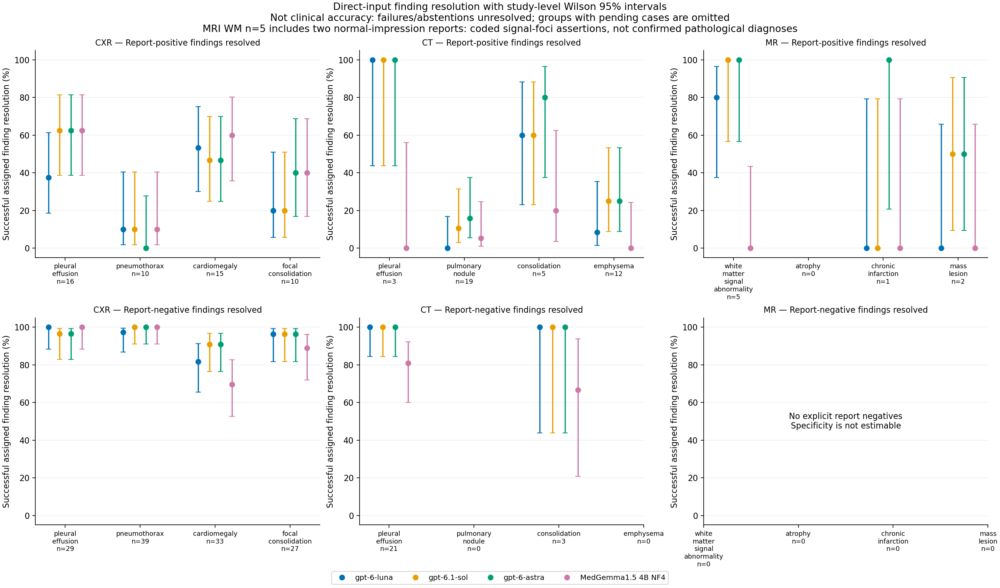
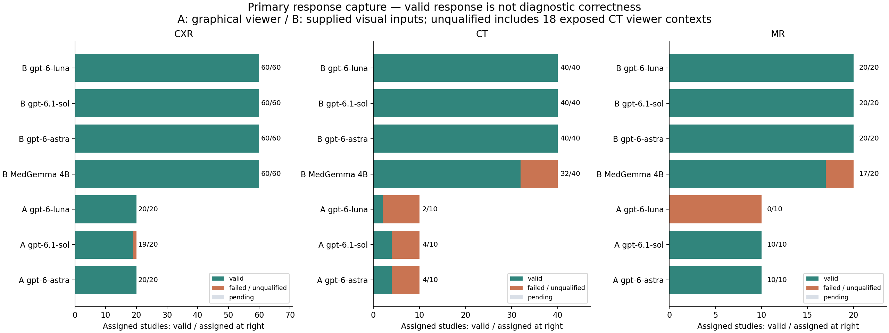

# OpenMausbot imaging investigation: decisions and measured evidence

Updated 2026-10-01 02:33 UTC. Every frozen assignment has a recorded terminal outcome.

The direct-input investigation has observed diagnostic outcomes on 120/120 main studies. There are 0 pending assignments across all workflows. The main cohort is 60 chest radiograph studies, 40 corrected chest CT volumes and 20 released MRI studies; 30 separate fresh studies and 20 development studies are separately identified.

**Established:** the requested GPT identifiers and pinned MedGemma checkpoint can receive medical-image evidence through the existing OpenMausbot adapters. This investigation tests report-supported findings on radiographs, selected CT inputs and selected MRI inputs, plus budgeted graphical viewer workflows. It does not establish unrestricted diagnostic competence.

The original premise of improvement over earlier GPT imaging models was not directly tested: no historical-model control was assigned. Executed CT/MRI access establishes technical feasibility beyond radiographs, not proof that broader radiology accuracy has improved.

Published historical evidence already tested GPT-4V on selected CT, MRI and radiographic images in 2024, with strong modality recognition but unreliable diagnostic findings. The premise that earlier systems were useful mainly for chest X-rays is therefore too broad: modality access and clinical usefulness are different questions. That external study is not reproduced here and cannot supply a numerical historical baseline for these different cases and workflows. [Original Radiology study](https://pubs.rsna.org/doi/10.1148/radiol.240955).

**Completed CT finding:** direct workflows resolved few explicit report-positive pulmonary nodules (MedGemma 1.5 4B NF4: 1/19; gpt-6-astra: 3/19; gpt-6-luna: 0/19; gpt-6.1-sol: 2/19). Remaining assertions include explicit absent calls, abstentions, insufficient inputs and invalid outputs, separated in the full tables. No explicit target-negative nodule reference was available, so specificity cannot be estimated. This supports rejecting these tested workflows for that finding; it does not locate the cause in the weights alone.

**Completed radiograph finding:** pneumothorax resolution is poor despite all 60 primary responses being captured for each model (MedGemma 1.5 4B NF4: 1/10 resolved, 9 explicit absent calls; gpt-6-astra: 0/10 resolved, 9 explicit absent calls; gpt-6-luna: 1/10 resolved, 8 explicit absent calls; gpt-6.1-sol: 1/10 resolved, 9 explicit absent calls). All ten positive reference reports, report/image mappings and PNG bytes passed an independent original-archive audit. Intervals and negative counts appear below; these are report-supported omissions, without clinical severity adjudication. Successful structured output therefore does not justify diagnostic trust in this workflow.

**Completed MRI finding:** mechanically coded white-matter signal-foci assertions are a possible narrower engineering target (MedGemma 1.5 4B NF4: 0/5 (0.0%; CI 0.0–43.4%); gpt-6-astra: 5/5 (100.0%; CI 56.6–100.0%); gpt-6-luna: 4/5 (80.0%; CI 37.6–96.4%); gpt-6.1-sol: 5/5 (100.0%; CI 56.6–100.0%)). Five coded positives give wide uncertainty even for five concordant outputs; MR-EVALUATION-005 and018 also have normal-examination impressions, so their pathological-abnormality interpretation is unresolved. These are not five confirmed pathological diagnoses, and there are no explicit target-negative MRI assertions under this frozen coder/sample. This supports a new report-grounded precision study, not MRI-wide diagnostic trust or a validated model ranking. A separately labeled post hoc source-scope sensitivity excluding those two reports leaves all three GPTs concordant on 3/3 assertions (Wilson 95% CI 43.9–100%) and MedGemma 0/3 (CI0–56.1%; two explicit absent calls and one invalid output). The frozen 5-case results remain unchanged; this restriction is an audit sensitivity, not a new clinical gold standard. Atrophy has no supported reference assertions in the primary MRI cohort and is unmeasured there.

**Material audit findings:** MedGemma’s volumetric montages are stretched to square by its processor, so intrinsic model ability cannot be separated from that input distortion. 18 viewer reads received unplanned earlier-conversation context, including prior model conclusions. These outputs and traces are retained; both sides of those pairs are excluded from independent A-versus-B comparisons. Clean subsequent contexts are audited at the native provider boundary. 198 assignments currently have recovery-assisted outcomes after documented setup failures before any diagnostic dispatch.

**Decision boundary:** patient-care deployment and radiologist equivalence are not supported. A research workflow may justify further engineering if it meets the frozen response-completion criterion and passes identity/isolation audit. Existing doctors’ reports support assertion concordance; no live clinicians reviewed these outputs. Translation, incomplete report assertions, public training exposure and small class counts limit clinical interpretation.

## Requested models: execution under the frozen budget

The table concerns recovery-assisted primary attachment workflows. The frozen mechanical gate is at least 95% qualified responses with a Wilson 95% lower bound at least 80%, and clean identity/isolation. It is an engineering gate, not an accuracy or clinical safety threshold. Gate verdicts require completed groups; any incomplete group remains pending.

| Scope | Model | Qualified responses / assigned (95% CI) | Setup failures / recovered | Median inference seconds | Research execution verdict |
|---|---|---|---|---|---|
| CT / supplied views | MedGemma 1.5 4B NF4 | 32/40 (80.0%; CI 65.2–89.5%) | 21 / 21 | 24.3 | not supported under this frozen execution gate |
| CT / supplied views | gpt-6-astra | 40/40 (100.0%; CI 91.2–100.0%) | 26 / 26 | 20.9 | supported for response-capture engineering |
| CT / supplied views | gpt-6-luna | 40/40 (100.0%; CI 91.2–100.0%) | 25 / 25 | 14.6 | supported for response-capture engineering |
| CT / supplied views | gpt-6.1-sol | 40/40 (100.0%; CI 91.2–100.0%) | 26 / 26 | 24.1 | supported for response-capture engineering |
| CXR / supplied views | MedGemma 1.5 4B NF4 | 60/60 (100.0%; CI 94.0–100.0%) | 59 / 59 | 18.6 | supported for response-capture engineering |
| CXR / supplied views | gpt-6-astra | 60/60 (100.0%; CI 94.0–100.0%) | 2 / 2 | 13.6 | supported for response-capture engineering |
| CXR / supplied views | gpt-6-luna | 60/60 (100.0%; CI 94.0–100.0%) | 3 / 3 | 9.4 | supported for response-capture engineering |
| CXR / supplied views | gpt-6.1-sol | 60/60 (100.0%; CI 94.0–100.0%) | 3 / 3 | 15.4 | supported for response-capture engineering |
| MR / supplied views | MedGemma 1.5 4B NF4 | 17/20 (85.0%; CI 64.0–94.8%) | 20 / 20 | 22.7 | not supported under this frozen execution gate |
| MR / supplied views | gpt-6-astra | 20/20 (100.0%; CI 83.9–100.0%) | 0 / 0 | 22.0 | supported for response-capture engineering |
| MR / supplied views | gpt-6-luna | 20/20 (100.0%; CI 83.9–100.0%) | 0 / 0 | 16.3 | supported for response-capture engineering |
| MR / supplied views | gpt-6.1-sol | 20/20 (100.0%; CI 83.9–100.0%) | 0 / 0 | 27.5 | supported for response-capture engineering |

## What the existing doctors’ reports support

Each row is a separately scored finding. Counts use released study identities, with one selected CT/MRI study per released patient identifier. OpenI longitudinal patient linkage and cross-source linkage are unavailable; complete global patient independence cannot be certified, so independence-based intervals may be optimistic if identities overlap. Positive and negative report assertions are explicit; omissions, ambiguity and conflicts are excluded. End-to-end success retains failed or abstained assigned cases. Completed-only sensitivity and specificity appear in the full results, with confusion counts and missing-outcome bounds. These are not severity-weighted clinical error rates.

The concise tables display the finding with the most explicit positive report assertions in each modality, selected by reference count rather than model results. All four findings appear in the figure and full appendix. Positive and negative resolution fractions below use all explicit assigned report assertions, including unresolved cases. They measure successful finding resolution under the workflow budget, not completed-only sensitivity/specificity. Pending fractions are execution progress until that group finishes.

| Scope | Model | Finding | Positive assertions resolved (95% CI) | Negative assertions resolved (95% CI) |
|---|---|---|---|---|
| CT | MedGemma 1.5 4B NF4 | pulmonary_nodule | 1/19 (5.3%; CI 0.9–24.6%) | not estimable |
| CT | gpt-6-astra | pulmonary_nodule | 3/19 (15.8%; CI 5.5–37.6%) | not estimable |
| CT | gpt-6-luna | pulmonary_nodule | 0/19 (0.0%; CI 0.0–16.8%) | not estimable |
| CT | gpt-6.1-sol | pulmonary_nodule | 2/19 (10.5%; CI 2.9–31.4%) | not estimable |
| CXR | MedGemma 1.5 4B NF4 | pleural_effusion | 10/16 (62.5%; CI 38.6–81.5%) | 29/29 (100.0%; CI 88.3–100.0%) |
| CXR | gpt-6-astra | pleural_effusion | 10/16 (62.5%; CI 38.6–81.5%) | 28/29 (96.6%; CI 82.8–99.4%) |
| CXR | gpt-6-luna | pleural_effusion | 6/16 (37.5%; CI 18.5–61.4%) | 29/29 (100.0%; CI 88.3–100.0%) |
| CXR | gpt-6.1-sol | pleural_effusion | 10/16 (62.5%; CI 38.6–81.5%) | 28/29 (96.6%; CI 82.8–99.4%) |
| MR | MedGemma 1.5 4B NF4 | white_matter_signal_abnormality | 0/5 (0.0%; CI 0.0–43.4%) | not estimable |
| MR | gpt-6-astra | white_matter_signal_abnormality | 5/5 (100.0%; CI 56.6–100.0%) | not estimable |
| MR | gpt-6-luna | white_matter_signal_abnormality | 4/5 (80.0%; CI 37.6–96.4%) | not estimable |
| MR | gpt-6.1-sol | white_matter_signal_abnormality | 5/5 (100.0%; CI 56.6–100.0%) | not estimable |

## Input methods: supported comparison and practical limits

Scope → same underlying released studies, graphical Weasis versus fixed visual attachments. Observed result → the paired table below contains only clean, reference-supported pairs. Uncertainty → small class denominators and exploratory paired-study bootstrap intervals; a pending comparison has no effect estimate. Failure modes → limited viewer navigation and initial inferior CT slice, incomplete sampled volume coverage, different delivered resolutions, and the quarantined context defect. Decision → do not transfer any advantage to native DICOM understanding, full original examinations or model reasoning alone.

Native GPT transport also changes image evidence: audited MRI samples were approximately aspect-preservingly resized from 2048×1620 RGB source montages to 1779×1408 RGBA before dispatch. All 240 images in 60 audited main MRI traces follow this transformation. [Exact Codex 0.159.2 source](https://github.com/openai/codex/blob/rust-v0.159.2/codex-rs/utils/image/src/lib.rs) confirms the high-detail patch-budget resize mechanism; integer rounding changes aspect ratio by about 0.056%. Source attachment hashes therefore do not prove native byte identity for those inputs. Audited case identity and four-image count remain correct; no scores, preprocessing or diagnostic turns were changed after this finding.

Graphical call limits are controller targets, not proof that asynchronous requests stop exactly at the limit. Some retained timeout runs report 25–26 native tool calls against the configured 24-call budget; request counts, approvals and recorded completion differ. The coverage audit preserves these counts. No timeout is rescued as a valid response and no held-out turn is rerun.

The research DICOM conversion preserves source intensities, affine orientation and spacing, and records windowing and sequence-family identity. It does not reconstruct original DICOM acquisition timing, echo/repetition parameters or contrast status from the released NIfTI/PNG sources. MRI contrast status is not inferred. These limits matter particularly for lesion characterization and prevent claiming faithful reproduction of every original clinical examination.

Independent visual inspection of the clean CT-EVALUATION-010/Sol viewer trace found 11 delivered desktop screenshots covering nine distinct slice counters out of 247 available frames. Its declared image references were supported. This demonstrates navigation across the volume but sparse anatomical inspection; screenshot uniqueness is not unique slice coverage. The example is a trace audit, not an estimate of all viewer coverage or a clinically adjudicated explanation for a missed finding.

One auxiliary CXR/Luna exact-screenshot re-interpretation was executed on the first technically eligible clean source case, using its two native model-delivered screenshots. It is not pooled with the primary cohort and cannot establish a general matched-evidence advantage. Other eligible comparisons exceed the original request budget. Adaptive slice requests, selective delegation and hybrid viewer-plus-specialist inference were not executed as primary conditions; their absence prevents broad separation of reasoning from evidence selection and navigation.

| Scope | Model | Finding | Clean paired studies | Excluded context cases | B minus A label success | 95% exploratory bootstrap interval |
|---|---|---|---|---|---|---|
| CXR | gpt-6-luna | pleural_effusion | 16 | 0 | -6.2 pp | -18.8 to +0.0 pp |
| CXR | gpt-6.1-sol | pleural_effusion | 16 | 0 | +6.2 pp | +0.0 to +18.8 pp |
| CXR | gpt-6-astra | pleural_effusion | 16 | 0 | +0.0 pp | +0.0 to +0.0 pp; exact bound on absolute difference 17.1 pp |
| CT | gpt-6-luna | pulmonary_nodule | 3 | 6 | +0.0 pp | +0.0 to +0.0 pp; exact bound on absolute difference 63.2 pp |
| CT | gpt-6.1-sol | pulmonary_nodule | 3 | 6 | +0.0 pp | +0.0 to +0.0 pp; exact bound on absolute difference 63.2 pp |
| CT | gpt-6-astra | pulmonary_nodule | 3 | 6 | +0.0 pp | +0.0 to +0.0 pp; exact bound on absolute difference 63.2 pp |
| MR | gpt-6-luna | white_matter_signal_abnormality | 2 | 0 | +100.0 pp | +100.0 to +100.0 pp; exact paired p=0.5; small-sample bootstrap boundary |
| MR | gpt-6.1-sol | white_matter_signal_abnormality | 2 | 0 | +50.0 pp | +0.0 to +100.0 pp |
| MR | gpt-6-astra | white_matter_signal_abnormality | 2 | 0 | +0.0 pp | +0.0 to +0.0 pp; exact bound on absolute difference 77.6 pp |

## Auxiliary matched-screen case

One CXR/Luna case received exactly the two screenshot byte strings previously delivered in its clean viewer read. Native input-image hashes equal both source screenshot hashes. This is one reused study, not an additional primary patient; tool affordances, instructions and time budgets differ. It demonstrates a technically feasible matched visual-input comparison, not general superiority.

| Explicit finding | Reference | A viewer state | B original-image state | B exact-screen state |
|---|---|---|---|---|
| pleural_effusion | present | uncertain | absent | present |
| cardiomegaly | present | uncertain | absent | uncertain |
| focal_consolidation | absent | absent | absent | absent |

Identity, durations, preserved result paths and assertion concordance are in `report/matched-screenshot-comparison.json`. No confidence interval or model ranking is inferred from this single study.

## MedGemma: standalone, delegated and independent second reader

**Verified MedGemma montage distortion:** the default processor stretches each 2048×1080 CT montage to 896×896, changing each tile’s aspect ratio by about 1.90. MRI montage distortion is about 1.26. This verifies the transformation, not a defect in the official processor or its training convention. The held-out pipeline is preserved unchanged; these results assess that workflow, not intrinsic volumetric ability or an optimized complete-volume input protocol.

Scope → pinned 4B multimodal weights, NF4 quantization, greedy bounded generation, up to four visual inputs prepared by the default square processor: released CXR views and fixed CT/MRI montages. It is not the untested 27B variant or Google’s complete-volume evaluation protocol. Independent MedGemma reads were saved before GPT consultation. Delegation calls exactly one assigned-study tool; second-reading reveals the saved initial GPT answer and the independent MedGemma read to a fresh GPT context. Self-review provides the initial GPT answer without a specialist.

Some MedGemma outputs exhaust the frozen 1,600-token generation allowance with unfinished JSON; the platform rejects a non-stop completion. Separate image-free requests are rejected by the strict visual-evidence guard before any GPU inference, including processor preparation. Their exact relationship to each truncated read requires native request linkage and is not presumed. Original truncated responses and guard failures are preserved. Unusable first reads are not repaired or rerun. The generation cap, repetition controls and image guard remain unchanged.

The following changes are report-supported label transitions among completed diagnostic labels, distinct from recovery of abstentions or technical failures. Zero reversals with a small sample do not establish safety. Agreement between models is not evidence of correctness. Degenerate bootstrap intervals with no discordance do not establish equivalence or noninferiority.

`report/specialist-transitions.json` retains baseline, independent specialist and final assertion states. It separately counts shared wrong labels, correct specialist assertions followed by a wrong or unresolved final label, and both initially concordant readers followed by a discordant final label. These are observed three-way patterns, not proof that consultation caused an error or that the GPT deliberately ignored the specialist.

| Scope | Model | Finding | Condition | Paired studies | Completed wrong→correct / correct→wrong | Label-success difference | 95% exploratory bootstrap interval |
|---|---|---|---|---|---|---|---|
| CXR | gpt-6-luna | pleural_effusion | delegated | 16 | 0 / 0 | +6.2 pp | +0.0 to +18.8 pp |
| CXR | gpt-6-luna | pleural_effusion | second-reader | 16 | 0 / 0 | +0.0 pp | +0.0 to +0.0 pp; exact bound on absolute difference 17.1 pp |
| CXR | gpt-6-luna | pleural_effusion | self-review | 4 | 0 / 0 | +0.0 pp | +0.0 to +0.0 pp; exact bound on absolute difference 52.7 pp |
| CXR | gpt-6.1-sol | pleural_effusion | delegated | 16 | 0 / 0 | +0.0 pp | +0.0 to +0.0 pp; exact bound on absolute difference 17.1 pp |
| CXR | gpt-6.1-sol | pleural_effusion | second-reader | 16 | 0 / 0 | +0.0 pp | +0.0 to +0.0 pp; exact bound on absolute difference 17.1 pp |
| CXR | gpt-6.1-sol | pleural_effusion | self-review | 4 | 0 / 0 | +0.0 pp | +0.0 to +0.0 pp; exact bound on absolute difference 52.7 pp |
| CXR | gpt-6-astra | pleural_effusion | delegated | 16 | 0 / 0 | +0.0 pp | +0.0 to +0.0 pp; exact bound on absolute difference 17.1 pp |
| CXR | gpt-6-astra | pleural_effusion | second-reader | 16 | 0 / 0 | +0.0 pp | +0.0 to +0.0 pp; exact bound on absolute difference 17.1 pp |
| CXR | gpt-6-astra | pleural_effusion | self-review | 4 | 0 / 0 | +0.0 pp | +0.0 to +0.0 pp; exact bound on absolute difference 52.7 pp |
| CT | gpt-6-luna | pulmonary_nodule | delegated | 5 | 0 / 0 | +0.0 pp | +0.0 to +0.0 pp; exact bound on absolute difference 45.1 pp |
| CT | gpt-6-luna | pulmonary_nodule | second-reader | 5 | 0 / 0 | +0.0 pp | +0.0 to +0.0 pp; exact bound on absolute difference 45.1 pp |
| CT | gpt-6-luna | pulmonary_nodule | self-review | 1 | 0 / 0 | +0.0 pp | +0.0 to +0.0 pp; exact bound on absolute difference 95.0 pp |
| CT | gpt-6.1-sol | pulmonary_nodule | delegated | 5 | 0 / 0 | +0.0 pp | +0.0 to +0.0 pp; exact bound on absolute difference 45.1 pp |
| CT | gpt-6.1-sol | pulmonary_nodule | second-reader | 5 | 0 / 0 | +0.0 pp | +0.0 to +0.0 pp; exact bound on absolute difference 45.1 pp |
| CT | gpt-6.1-sol | pulmonary_nodule | self-review | 1 | 0 / 0 | +0.0 pp | +0.0 to +0.0 pp; exact bound on absolute difference 95.0 pp |
| CT | gpt-6-astra | pulmonary_nodule | delegated | 5 | 0 / 0 | -20.0 pp | -60.0 to +0.0 pp |
| CT | gpt-6-astra | pulmonary_nodule | second-reader | 5 | 0 / 0 | +0.0 pp | +0.0 to +0.0 pp; exact bound on absolute difference 45.1 pp |
| CT | gpt-6-astra | pulmonary_nodule | self-review | 1 | 0 / 0 | +0.0 pp | +0.0 to +0.0 pp; exact bound on absolute difference 95.0 pp |
| MR | gpt-6-luna | white_matter_signal_abnormality | delegated | 2 | 0 / 1 | -50.0 pp | -100.0 to +0.0 pp |
| MR | gpt-6-luna | white_matter_signal_abnormality | second-reader | 2 | 0 / 0 | +0.0 pp | +0.0 to +0.0 pp; exact bound on absolute difference 77.6 pp |
| MR | gpt-6-luna | white_matter_signal_abnormality | self-review | 1 | 0 / 0 | +0.0 pp | +0.0 to +0.0 pp; exact bound on absolute difference 95.0 pp |
| MR | gpt-6.1-sol | white_matter_signal_abnormality | delegated | 2 | 0 / 0 | +0.0 pp | +0.0 to +0.0 pp; exact bound on absolute difference 77.6 pp |
| MR | gpt-6.1-sol | white_matter_signal_abnormality | second-reader | 2 | 0 / 0 | +0.0 pp | +0.0 to +0.0 pp; exact bound on absolute difference 77.6 pp |
| MR | gpt-6.1-sol | white_matter_signal_abnormality | self-review | 1 | 0 / 0 | +0.0 pp | +0.0 to +0.0 pp; exact bound on absolute difference 95.0 pp |
| MR | gpt-6-astra | white_matter_signal_abnormality | delegated | 2 | 0 / 0 | +0.0 pp | +0.0 to +0.0 pp; exact bound on absolute difference 77.6 pp |
| MR | gpt-6-astra | white_matter_signal_abnormality | second-reader | 2 | 0 / 0 | +0.0 pp | +0.0 to +0.0 pp; exact bound on absolute difference 77.6 pp |
| MR | gpt-6-astra | white_matter_signal_abnormality | self-review | 1 | 0 / 0 | +0.0 pp | +0.0 to +0.0 pp; exact bound on absolute difference 95.0 pp |

### Measured specialist changes across supported assertions

The following counts include all three GPTs. A finding/model/condition comparison is the counting unit; the same study and multiple findings recur, so these are not independent patient counts or a pooled clinical accuracy estimate. Gained/lost resolution includes recovery from, or loss to, an unresolved outcome. The completed-label columns separately count binary corrections/reversals. Observed recoveries accompany losses; these sparse exploratory changes do not establish a general specialist benefit or causal harm.

| Scope / condition | Supported finding comparisons | Distinct supported studies | Gained / lost resolution | Completed-label corrections / reversals |
|---|---|---|---|---|
| CT / delegated | 42 | 8 | 0 / 1 | 0 / 0 |
| CT / second-reader | 42 | 8 | 0 / 0 | 0 / 0 |
| CXR / delegated | 195 | 20 | 1 / 2 | 0 / 0 |
| CXR / second-reader | 195 | 20 | 1 / 1 | 0 / 0 |
| MR / delegated | 12 | 2 | 0 / 2 | 0 / 1 |
| MR / second-reader | 12 | 2 | 0 / 1 | 0 / 0 |

The sole completed binary reversal is the Luna delegated white-matter finding on MR-EVALUATION-005, whose normal-impression inconsistency is disclosed above. It remains a frozen-coded reversal, not confirmed clinical harm, and is excluded by the separately labeled source-scope sensitivity. Astra’s MRI resolution losses in both specialist conditions are MR-EVALUATION-001 infarction answers changing from present to abstained with an invalid specialist read. Luna’s shared-wrong emphysema assertion on CT-EVALUATION-002 persists in both specialist conditions. These named patterns do not isolate consultation causality.

### Specialist versus self-review on identical controls

The ten control studies were prespecified. This exploratory same-case comparison was added during the audit while execution continued. It directly compares each specialist condition with a fresh self-review on those identical studies; comparing all 40 specialist studies against 10 self-review studies would confound case mix. Few explicit report assertions support each cell; no confirmatory specialist-benefit claim follows. Pending pairs have no effect estimate.

| Scope | Model | Finding | Specialist condition | Supported control pairs | Specialist minus self-review success | Exploratory95% interval |
|---|---|---|---|---|---|---|
| CXR | gpt-6-luna | pleural_effusion | delegated | 4 | +0.0 pp | +0.0 to +0.0 pp; exact bound on absolute difference 52.7 pp |
| CXR | gpt-6-luna | pleural_effusion | second-reader | 4 | +0.0 pp | +0.0 to +0.0 pp; exact bound on absolute difference 52.7 pp |
| CXR | gpt-6.1-sol | pleural_effusion | delegated | 4 | +0.0 pp | +0.0 to +0.0 pp; exact bound on absolute difference 52.7 pp |
| CXR | gpt-6.1-sol | pleural_effusion | second-reader | 4 | +0.0 pp | +0.0 to +0.0 pp; exact bound on absolute difference 52.7 pp |
| CXR | gpt-6-astra | pleural_effusion | delegated | 4 | +0.0 pp | +0.0 to +0.0 pp; exact bound on absolute difference 52.7 pp |
| CXR | gpt-6-astra | pleural_effusion | second-reader | 4 | +0.0 pp | +0.0 to +0.0 pp; exact bound on absolute difference 52.7 pp |
| CT | gpt-6-luna | pulmonary_nodule | delegated | 1 | +0.0 pp | +0.0 to +0.0 pp; exact bound on absolute difference 95.0 pp |
| CT | gpt-6-luna | pulmonary_nodule | second-reader | 1 | +0.0 pp | +0.0 to +0.0 pp; exact bound on absolute difference 95.0 pp |
| CT | gpt-6.1-sol | pulmonary_nodule | delegated | 1 | +0.0 pp | +0.0 to +0.0 pp; exact bound on absolute difference 95.0 pp |
| CT | gpt-6.1-sol | pulmonary_nodule | second-reader | 1 | +0.0 pp | +0.0 to +0.0 pp; exact bound on absolute difference 95.0 pp |
| CT | gpt-6-astra | pulmonary_nodule | delegated | 1 | +0.0 pp | +0.0 to +0.0 pp; exact bound on absolute difference 95.0 pp |
| CT | gpt-6-astra | pulmonary_nodule | second-reader | 1 | +0.0 pp | +0.0 to +0.0 pp; exact bound on absolute difference 95.0 pp |
| MR | gpt-6-luna | white_matter_signal_abnormality | delegated | 1 | +0.0 pp | +0.0 to +0.0 pp; exact bound on absolute difference 95.0 pp |
| MR | gpt-6-luna | white_matter_signal_abnormality | second-reader | 1 | +0.0 pp | +0.0 to +0.0 pp; exact bound on absolute difference 95.0 pp |
| MR | gpt-6.1-sol | white_matter_signal_abnormality | delegated | 1 | +0.0 pp | +0.0 to +0.0 pp; exact bound on absolute difference 95.0 pp |
| MR | gpt-6.1-sol | white_matter_signal_abnormality | second-reader | 1 | +0.0 pp | +0.0 to +0.0 pp; exact bound on absolute difference 95.0 pp |
| MR | gpt-6-astra | white_matter_signal_abnormality | delegated | 1 | +0.0 pp | +0.0 to +0.0 pp; exact bound on absolute difference 95.0 pp |
| MR | gpt-6-astra | white_matter_signal_abnormality | second-reader | 1 | +0.0 pp | +0.0 to +0.0 pp; exact bound on absolute difference 95.0 pp |

Of 66 estimable same-control task cells, the only nonzero success difference is Luna/CXR cardiomegaly in second-reading versus self-review: one additional resolved assertion among four supported pairs (+25 pp; exploratory bootstrap 0–75 pp; exact McNemar p=1.0). The other 65 estimable cells have zero observed difference, and six cells have no reference support. These small, repeated endpoint comparisons do not establish specialist benefit or equivalence.

All 72 control-task cells, reference-positive/negative counts, case IDs, gain/loss counts and exact discordance bounds are preserved in `report/self-review-controlled-comparisons.json`. This supplement leaves frozen scoring and primary comparisons unchanged.

No claim of cheaper acceptably equivalent MedGemma performance is supported: subscription-dollar allocation and hardware costs are unavailable, and no confirmatory noninferiority analysis exists. The role comparisons and same-case controls are exploratory, with small endpoint support and no confirmatory specialist-benefit analysis.

## Fresh studies, repeats and cost

Fresh-case Sol and MedGemma testing was prespecified, not assigned to an apparent winner. Its 30 studies do not validate all three GPTs or specialist roles. Repeat runs are paired stability observations and never inflate patient counts.

| Fresh scope | Model | Qualified responses /10 (95% CI) | Median seconds |
|---|---|---|---|
| CT | MedGemma 1.5 4B NF4 | 6/10 (60.0%; CI 31.3–83.2%) | 74.2 |
| CT | gpt-6.1-sol | 10/10 (100.0%; CI 72.2–100.0%) | 21.8 |
| CXR | MedGemma 1.5 4B NF4 | 10/10 (100.0%; CI 72.2–100.0%) | 16.4 |
| CXR | gpt-6.1-sol | 10/10 (100.0%; CI 72.2–100.0%) | 16.7 |
| MR | MedGemma 1.5 4B NF4 | 7/10 (70.0%; CI 39.7–89.2%) | 26.9 |
| MR | gpt-6.1-sol | 10/10 (100.0%; CI 72.2–100.0%) | 26.5 |

Fresh diagnostic support is sparse and does not replicate every primary endpoint: the ten fresh CXR studies contain no explicit positive effusion, pneumothorax or consolidation assertions; their five cardiomegaly positives resolve in 1/5 Sol and 3/5 MedGemma outputs. The ten fresh CT studies contain one explicit nodule positive: neither workflow resolves it (Sol unresolved, MedGemma explicitly absent). No reference-positive white-matter signal-foci assertion is coded in the ten fresh MRI studies under the frozen rule, so that narrower primary finding receives no scored fresh validation here. This is a coding limitation: MR-FRESH-003 describes frontal white-matter gliotic lesions that the narrow rule omitted, and MR-FRESH-002 describes cerebellar masses omitted by the mass rule. Neither omission means the reports lack those findings; both remain unscored without retrospective label changes. Both Sol and MedGemma resolve 1/2 atrophy positives and 1/1 chronic-infarction positive in fresh MRI; these tiny counts do not establish broad MRI accuracy. All class-specific denominators, unresolved categories and intervals are in the full tables.

MedGemma 1.5 4B NF4: 8/8 repeat pairs with identical finding-status objects among pairs with two qualified responses; 2/10 pairs lack two qualified responses. These are descriptive stability counts, not independent clinical cases.

gpt-6-astra: 7/10 repeat pairs with identical finding-status objects among pairs with two qualified responses; 0/10 pairs lack two qualified responses. These are descriptive stability counts, not independent clinical cases.

gpt-6-luna: 7/10 repeat pairs with identical finding-status objects among pairs with two qualified responses; 0/10 pairs lack two qualified responses. These are descriptive stability counts, not independent clinical cases.

gpt-6.1-sol: 6/10 repeat pairs with identical finding-status objects among pairs with two qualified responses; 0/10 pairs lack two qualified responses. These are descriptive stability counts, not independent clinical cases.

Observed GPT diagnostic-case usage, including development and the four native-only receipts, is 66,584,015 input tokens and 405,317 output tokens. This is a measured subtotal separate from the investigation/curation assistants. Local MedGemma has 172 measured serving records totaling 6226.7 inference seconds, plus 3 records without duration; 19 additional guard rejections occur before inference. Serving records include development and cannot be substituted for the 160 frozen study reads. These quantities are not dollar or energy totals.

### Component timing on identical control studies

These medians restrict all three role workflows to the same prespecified controls within each modality/model. They sum recorded diagnostic components for a hypothetical separately deployed workflow, including specialist inference where required. They exclude setup/preprocessing, are not observed serial wall time, and do not establish a price or latency ranking. Pending or incomplete timing remains unavailable. No additional inference was performed for this accounting refinement.

| Scope / model | Same control studies | Delegated seconds | Second-reader seconds | Self-review seconds |
|---|---|---|---|---|
| CT / gpt-6-astra | 3 | 53.2 | 62.2 | 36.6 |
| CT / gpt-6-luna | 3 | 41.3 | 57.4 | 32.5 |
| CT / gpt-6.1-sol | 3 | 54.0 | 82.0 | 45.0 |
| CXR / gpt-6-astra | 5 | 38.7 | 43.4 | 25.4 |
| CXR / gpt-6-luna | 5 | 33.6 | 39.5 | 20.9 |
| CXR / gpt-6.1-sol | 5 | 39.1 | 47.2 | 28.2 |
| MR / gpt-6-astra | 2 | 103.7 | 121.4 | 44.1 |
| MR / gpt-6-luna | 2 | 100.0 | 101.5 | 31.3 |
| MR / gpt-6.1-sol | 2 | 106.2 | 125.7 | 50.3 |

The original self-imposed conversation ceiling was 1000, based on 29 development conversations. Independent native-thread reconciliation found 31, including two off-depth quarantined reads. Before reaching the original ceiling, the operating cap was prospectively corrected to 1002 to finish the same 970 frozen assignments plus one auxiliary read. The original protocol remains unchanged and the deviation is explicit in evidence/budget-accounting-correction.json. All development dispatches count, including failures and quarantines; no extra experimental conditions were added.

No purchases or upgrades were made. The authorized free banked reset was used. Existing account quota, CPU and GPU are shared; durations include contention. Cached input is a subset of input and is not added twice. Missing usage is not zero cost. Native case starts are limited to 6/min; internal graphical-agent model round trips are not independently rate-limited by that dispatch limiter. MedGemma serving compute is measured locally; electricity, depreciation and clinician costs are unpriced.

The 180s/120s limits govern diagnostic turns after setup/dispatch. Recovery-assisted closure and preprocessing can take much longer and are not included in median inference latency. First-attempt workspace reliability differs from recovery-assisted response capture; both are recorded in operational-metrics.

A cached specialist read is physically inferred once. An independently deployed consultation workflow must account for initial GPT inference, specialist inference and synthesis inference; the tool’s cached lookup time alone is not the full cost. Machine-readable operational data contain usage subtotals, missing-measurement counts, latency and status categories. `report/resource-cost-inventory.json` separately includes development, all recorded local inference durations and the latest per-case preprocessing receipts; overlapping rerun receipts are not added. Four additional development dispatches lack framework results but have audited native receipts: 434573 input tokens, including 341632 cached, and 1927 output tokens. These are counted once in the corrected guards and separate cost inventory, without inventing controller outcomes. Whole lifecycle dollar/energy cost remains unavailable.

Controller development, investigation, curation and audit assistant usage is outside the diagnostic-case token ledger. Consequently the case totals do not represent the complete cost of this investigation. `report/response-coverage-audit.json` separately records descriptive prompt-limit violations, exact filename references, actual native screenshot counts and recorded graphical action outcomes; it does not retrospectively change frozen clinical scoring. Screenshot counts alone do not prove unique slices or complete anatomical coverage.

`report/role-cost-attribution.json` attributes delegated roles to the fresh GPT turn plus independent specialist inference; second-reading to original GPT, specialist and synthesis turns; and self-review to two GPT turns. These are component duration/token observations for separate deployment scenarios, not measured serial wall time or additional physical GPU executions. Preprocessing and setup remain separate. A standalone limited differential was not elicited by the frozen schema, so differential-diagnosis quality is unmeasured.

## Representative report-supported outcomes and failures

Examples below are selected by deterministic case ordering to illustrate measured categories, not to estimate their prevalence. They concern only explicit report assertions. Additional findings without a reference assertion are unscorable, rather than automatically false. Detailed causal inspection and independent trace audits accompany the final report.

The major-conclusion source audit checks all ten report-positive pneumothorax studies and all nineteen nodule-positive CT studies. CT-EVALUATION-008 has one historical nonvisualized nodule clause incorrectly tagged present by the mechanical coder; independent current nodules and the impression support the case-level positive label. The clause defect is retained and disclosed, with no label, denominator or result change. Existing report concordance does not establish whether a lesion is visible in the particular delivered frames.

| Category | Scope / model / case | Finding | Reference → output | Preserved result |
|---|---|---|---|---|
| confirmed concordance | CXR / MedGemma 1.5 4B NF4 / CXR-EVALUATION-001 | focal_consolidation | absent → absent | [CXR-EVALUATION-001](evidence/evaluation/B/google--medgemma-1.5-4b-it/CXR-EVALUATION-001/result.json) |
| explicit report-positive omission | CXR / MedGemma 1.5 4B NF4 / CXR-EVALUATION-001 | pleural_effusion | present → absent | [CXR-EVALUATION-001](evidence/evaluation/B/google--medgemma-1.5-4b-it/CXR-EVALUATION-001/result.json) |
| insufficient or failed label resolution | CXR / MedGemma 1.5 4B NF4 / CXR-EVALUATION-001 | cardiomegaly | present → input_insufficient | [CXR-EVALUATION-001](evidence/evaluation/B/google--medgemma-1.5-4b-it/CXR-EVALUATION-001/result.json) |
| confirmed concordance | CT / MedGemma 1.5 4B NF4 / CT-EVALUATION-001 | pleural_effusion | absent → absent | [CT-EVALUATION-001](evidence/evaluation/B/google--medgemma-1.5-4b-it/CT-EVALUATION-001/result.json) |
| explicit report-positive omission | CT / MedGemma 1.5 4B NF4 / CT-EVALUATION-002 | emphysema | present → absent | [CT-EVALUATION-002](evidence/evaluation/B/google--medgemma-1.5-4b-it/CT-EVALUATION-002/result.json) |
| insufficient or failed label resolution | CT / MedGemma 1.5 4B NF4 / CT-EVALUATION-003 | consolidation | absent → invalid_output | [CT-EVALUATION-003](evidence/evaluation/B/google--medgemma-1.5-4b-it/CT-EVALUATION-003/result.json) |
| confirmed concordance | MR / gpt-6-astra / MR-EVALUATION-001 | chronic_infarction | present → present | [MR-EVALUATION-001](evidence/evaluation/B/gpt-6-astra/MR-EVALUATION-001/result.json) |
| explicit report-positive omission | MR / gpt-6-astra / MR-EVALUATION-001 | mass_lesion | present → absent | [MR-EVALUATION-001](evidence/evaluation/B/gpt-6-astra/MR-EVALUATION-001/result.json) |
| insufficient or failed label resolution | MR / MedGemma 1.5 4B NF4 / MR-EVALUATION-001 | chronic_infarction | present → invalid_output | [MR-EVALUATION-001](evidence/evaluation/B/google--medgemma-1.5-4b-it/MR-EVALUATION-001/result.json) |

## Concrete action and remaining evidence

**Supported for the stated research decision:** retain reproducible image-attachment and isolated-viewer engineering only where its completed operational gate and trace audit pass. Use the measured task-specific intervals to choose a narrower external validation target; do not choose a general-purpose “best radiology model” from this cohort.

**Not supported:** autonomous clinical use, radiologist-level claims, universal modality coverage, treating successful JSON as a correct diagnosis, claiming MedGemma is free or equivalent, or deploying the originally contaminated viewer-context configuration.

**Insufficient evidence:** broad MRI accuracy and specificity, institution-independent generalization, severity of unadjudicated errors, full-study versus selected-image interpretation, matched-evidence model superiority, and dollar return on investment. Under the frozen conservative clause coder, the selected MRI reference assertions include no target negatives; this is a limitation of this sampled endpoint/coding policy, not a claim that the source dataset has no normal studies. Reports were translated/restructured by dataset authors using another model.

To change those decisions, obtain institution-separated existing report-grounded cases with explicit positive and negative references, stronger original-language/reference reconciliation, technical coverage audits and preregistered precision targets. About 385 independent positives and 385 negatives per task provide a worst-case normal-approximation 95% margin near ±5 percentage points; zero misses in 59 positives yields a one-sided exact 95% upper miss-rate bound below 5%. This is sample planning, not a claim that case counts alone establish clinical safety.

## Full tables, provenance and reproducibility

The following appendix is regenerated from frozen assignments and preserved case records. It includes modality/task uncertainty, all-assigned failures, role transitions, source limitations, identifiers, isolation, sources and artifact paths. Private credentials and original reports remain separately protected. See [the requirement-to-evidence audit](REQUIREMENT-AUDIT.md) for all 15 requested responsibilities, their artifact locations and explicit gaps.

---

# OpenMausbot imaging benchmark — completed technical appendix

Updated 2026-10-01 02:33:35 UTC. Frozen protocol SHA256: `50848ef38e34d171b7a34d5736320a705cbc1953d8dbd9a0e9fc2b70a0aa5c34`.

970/970 assigned runs have recorded outcomes; 919 have valid structured responses and verified identity where exposed. 1235 controller attempts started (includes setup-only failures, not a provider-request count). 120/120 primary studies have at least one recorded diagnostic direct-input outcome (setup-only failures excluded). Pending assignments are not results. Preserved setup failures without diagnostic dispatch remain pending clinical assignments while recovery proceeds.

Responses exposed to unplanned earlier-conversation context are retained as context_contamination and excluded from fresh-context concordance and comparison inference. Counts of qualified responses require valid schema, verified native identity where exposed, and no detected earlier-conversation injection. This investigation measures agreement with explicit assertions in existing published doctors’ reports. It does not establish clinically adjudicated accuracy, radiologist equivalence, or safety for autonomous use. MRI specificity is not estimable because its supported target references contain no negatives.

## Execution reliability

| Stage | Modality | Arm/configuration | Model | Valid responses / assigned (95% CI) | Median seconds | Status counts |
|---|---|---|---|---|---|---|
| evaluation | CT | A/primary | gpt-6-astra | 4/10 (40.0%; 95% CI 16.8%–68.7%) | 133.4 | {'context_contamination': 6, 'completed': 4} |
| evaluation | CT | A/primary | gpt-6-luna | 2/10 (20.0%; 95% CI 5.7%–51.0%) | 92.5 | {'context_contamination': 6, 'budget_exhausted': 2, 'completed': 2} |
| evaluation | CT | A/primary | gpt-6.1-sol | 4/10 (40.0%; 95% CI 16.8%–68.7%) | 141.0 | {'context_contamination': 6, 'completed': 4} |
| evaluation | CT | B/delegated | gpt-6-astra | 10/10 (100.0%; 95% CI 72.2%–100.0%) | 30.6 | {'completed': 10} |
| evaluation | CT | B/delegated | gpt-6-luna | 10/10 (100.0%; 95% CI 72.2%–100.0%) | 20.5 | {'completed': 10} |
| evaluation | CT | B/delegated | gpt-6.1-sol | 10/10 (100.0%; 95% CI 72.2%–100.0%) | 30.4 | {'completed': 10} |
| evaluation | CT | B/primary | google/medgemma-1.5-4b-it | 32/40 (80.0%; 95% CI 65.2%–89.5%) | 24.3 | {'completed': 32, 'invalid_output': 8} |
| evaluation repeat | CT | B/primary | google/medgemma-1.5-4b-it | 2/3 (66.7%; 95% CI 20.8%–93.9%) | 22.5 | {'completed': 2, 'invalid_output': 1} |
| evaluation | CT | B/primary | gpt-6-astra | 40/40 (100.0%; 95% CI 91.2%–100.0%) | 20.9 | {'completed': 40} |
| evaluation repeat | CT | B/primary | gpt-6-astra | 3/3 (100.0%; 95% CI 43.9%–100.0%) | 21.3 | {'completed': 3} |
| evaluation | CT | B/primary | gpt-6-luna | 40/40 (100.0%; 95% CI 91.2%–100.0%) | 14.6 | {'completed': 40} |
| evaluation repeat | CT | B/primary | gpt-6-luna | 3/3 (100.0%; 95% CI 43.9%–100.0%) | 17.6 | {'completed': 3} |
| evaluation | CT | B/primary | gpt-6.1-sol | 40/40 (100.0%; 95% CI 91.2%–100.0%) | 24.1 | {'completed': 40} |
| evaluation repeat | CT | B/primary | gpt-6.1-sol | 3/3 (100.0%; 95% CI 43.9%–100.0%) | 23.3 | {'completed': 3} |
| evaluation | CT | B/second-reader | gpt-6-astra | 10/10 (100.0%; 95% CI 72.2%–100.0%) | 18.8 | {'completed': 10} |
| evaluation | CT | B/second-reader | gpt-6-luna | 10/10 (100.0%; 95% CI 72.2%–100.0%) | 14.6 | {'completed': 10} |
| evaluation | CT | B/second-reader | gpt-6.1-sol | 10/10 (100.0%; 95% CI 72.2%–100.0%) | 19.9 | {'completed': 10} |
| evaluation | CT | B/self-review | gpt-6-astra | 3/3 (100.0%; 95% CI 43.9%–100.0%) | 14.6 | {'completed': 3} |
| evaluation | CT | B/self-review | gpt-6-luna | 3/3 (100.0%; 95% CI 43.9%–100.0%) | 14.5 | {'completed': 3} |
| evaluation | CT | B/self-review | gpt-6.1-sol | 3/3 (100.0%; 95% CI 43.9%–100.0%) | 17.4 | {'completed': 3} |
| evaluation | CXR | A/primary | gpt-6-astra | 20/20 (100.0%; 95% CI 83.9%–100.0%) | 65.3 | {'completed': 20} |
| evaluation | CXR | A/primary | gpt-6-luna | 20/20 (100.0%; 95% CI 83.9%–100.0%) | 33.9 | {'completed': 20} |
| evaluation | CXR | A/primary | gpt-6.1-sol | 19/20 (95.0%; 95% CI 76.4%–99.1%) | 66.5 | {'completed': 19, 'timeout': 1} |
| evaluation | CXR | B/delegated | gpt-6-astra | 20/20 (100.0%; 95% CI 83.9%–100.0%) | 21.9 | {'completed': 20} |
| evaluation | CXR | B/delegated | gpt-6-luna | 20/20 (100.0%; 95% CI 83.9%–100.0%) | 15.0 | {'completed': 20} |
| evaluation | CXR | B/delegated | gpt-6.1-sol | 20/20 (100.0%; 95% CI 83.9%–100.0%) | 21.5 | {'completed': 20} |
| evaluation | CXR | B/primary | google/medgemma-1.5-4b-it | 60/60 (100.0%; 95% CI 94.0%–100.0%) | 18.6 | {'completed': 60} |
| evaluation repeat | CXR | B/primary | google/medgemma-1.5-4b-it | 5/5 (100.0%; 95% CI 56.6%–100.0%) | 18.5 | {'completed': 5} |
| evaluation | CXR | B/primary | gpt-6-astra | 60/60 (100.0%; 95% CI 94.0%–100.0%) | 13.6 | {'completed': 60} |
| evaluation repeat | CXR | B/primary | gpt-6-astra | 5/5 (100.0%; 95% CI 56.6%–100.0%) | 14.7 | {'completed': 5} |
| evaluation | CXR | B/primary | gpt-6-luna | 60/60 (100.0%; 95% CI 94.0%–100.0%) | 9.4 | {'completed': 60} |
| evaluation repeat | CXR | B/primary | gpt-6-luna | 5/5 (100.0%; 95% CI 56.6%–100.0%) | 9.8 | {'completed': 5} |
| evaluation | CXR | B/primary | gpt-6.1-sol | 60/60 (100.0%; 95% CI 94.0%–100.0%) | 15.4 | {'completed': 60} |
| evaluation repeat | CXR | B/primary | gpt-6.1-sol | 5/5 (100.0%; 95% CI 56.6%–100.0%) | 13.7 | {'completed': 5} |
| evaluation | CXR | B/second-reader | gpt-6-astra | 20/20 (100.0%; 95% CI 83.9%–100.0%) | 12.7 | {'completed': 20} |
| evaluation | CXR | B/second-reader | gpt-6-luna | 20/20 (100.0%; 95% CI 83.9%–100.0%) | 9.1 | {'completed': 20} |
| evaluation | CXR | B/second-reader | gpt-6.1-sol | 20/20 (100.0%; 95% CI 83.9%–100.0%) | 13.2 | {'completed': 20} |
| evaluation | CXR | B/self-review | gpt-6-astra | 5/5 (100.0%; 95% CI 56.6%–100.0%) | 11.9 | {'completed': 5} |
| evaluation | CXR | B/self-review | gpt-6-luna | 5/5 (100.0%; 95% CI 56.6%–100.0%) | 10.7 | {'completed': 5} |
| evaluation | CXR | B/self-review | gpt-6.1-sol | 5/5 (100.0%; 95% CI 56.6%–100.0%) | 12.9 | {'completed': 5} |
| evaluation | MR | A/primary | gpt-6-astra | 10/10 (100.0%; 95% CI 72.2%–100.0%) | 140.6 | {'completed': 10} |
| evaluation | MR | A/primary | gpt-6-luna | 0/10 (0.0%; 95% CI 0.0%–27.8%) | 91.4 | {'budget_exhausted': 8, 'timeout': 2} |
| evaluation | MR | A/primary | gpt-6.1-sol | 10/10 (100.0%; 95% CI 72.2%–100.0%) | 115.4 | {'completed': 7, 'abstained': 3} |
| evaluation | MR | B/delegated | gpt-6-astra | 10/10 (100.0%; 95% CI 72.2%–100.0%) | 30.0 | {'completed': 10} |
| evaluation | MR | B/delegated | gpt-6-luna | 10/10 (100.0%; 95% CI 72.2%–100.0%) | 23.0 | {'completed': 10} |
| evaluation | MR | B/delegated | gpt-6.1-sol | 10/10 (100.0%; 95% CI 72.2%–100.0%) | 33.1 | {'completed': 10} |
| evaluation | MR | B/primary | google/medgemma-1.5-4b-it | 17/20 (85.0%; 95% CI 64.0%–94.8%) | 22.7 | {'invalid_output': 3, 'completed': 17} |
| evaluation repeat | MR | B/primary | google/medgemma-1.5-4b-it | 1/2 (50.0%; 95% CI 9.5%–90.5%) | 74.9 | {'invalid_output': 1, 'completed': 1} |
| evaluation | MR | B/primary | gpt-6-astra | 20/20 (100.0%; 95% CI 83.9%–100.0%) | 22.0 | {'completed': 20} |
| evaluation repeat | MR | B/primary | gpt-6-astra | 2/2 (100.0%; 95% CI 34.2%–100.0%) | 23.5 | {'completed': 2} |
| evaluation | MR | B/primary | gpt-6-luna | 20/20 (100.0%; 95% CI 83.9%–100.0%) | 16.3 | {'completed': 20} |
| evaluation repeat | MR | B/primary | gpt-6-luna | 2/2 (100.0%; 95% CI 34.2%–100.0%) | 16.4 | {'completed': 2} |
| evaluation | MR | B/primary | gpt-6.1-sol | 20/20 (100.0%; 95% CI 83.9%–100.0%) | 27.5 | {'completed': 20} |
| evaluation repeat | MR | B/primary | gpt-6.1-sol | 2/2 (100.0%; 95% CI 34.2%–100.0%) | 29.7 | {'completed': 2} |
| evaluation | MR | B/second-reader | gpt-6-astra | 10/10 (100.0%; 95% CI 72.2%–100.0%) | 22.9 | {'completed': 10} |
| evaluation | MR | B/second-reader | gpt-6-luna | 10/10 (100.0%; 95% CI 72.2%–100.0%) | 13.2 | {'completed': 10} |
| evaluation | MR | B/second-reader | gpt-6.1-sol | 10/10 (100.0%; 95% CI 72.2%–100.0%) | 22.6 | {'completed': 10} |
| evaluation | MR | B/self-review | gpt-6-astra | 2/2 (100.0%; 95% CI 34.2%–100.0%) | 20.3 | {'completed': 2} |
| evaluation | MR | B/self-review | gpt-6-luna | 2/2 (100.0%; 95% CI 34.2%–100.0%) | 16.2 | {'completed': 2} |
| evaluation | MR | B/self-review | gpt-6.1-sol | 2/2 (100.0%; 95% CI 34.2%–100.0%) | 22.6 | {'completed': 2} |
| fresh-validation | CT | B/primary | google/medgemma-1.5-4b-it | 6/10 (60.0%; 95% CI 31.3%–83.2%) | 74.2 | {'invalid_output': 4, 'completed': 6} |
| fresh-validation | CT | B/primary | gpt-6.1-sol | 10/10 (100.0%; 95% CI 72.2%–100.0%) | 21.8 | {'completed': 10} |
| fresh-validation | CXR | B/primary | google/medgemma-1.5-4b-it | 10/10 (100.0%; 95% CI 72.2%–100.0%) | 16.4 | {'completed': 10} |
| fresh-validation | CXR | B/primary | gpt-6.1-sol | 10/10 (100.0%; 95% CI 72.2%–100.0%) | 16.7 | {'completed': 10} |
| fresh-validation | MR | B/primary | google/medgemma-1.5-4b-it | 7/10 (70.0%; 95% CI 39.7%–89.2%) | 26.9 | {'invalid_output': 3, 'completed': 7} |
| fresh-validation | MR | B/primary | gpt-6.1-sol | 10/10 (100.0%; 95% CI 72.2%–100.0%) | 26.5 | {'completed': 10} |

## Primary direct-input report concordance

Class omissions and uncertain report assertions are excluded; abstentions and technical failures remain in assigned reference-supported denominators. Completed-only sensitivity/specificity and all-assigned successful label resolution answer different questions. While runs are pending, all-assigned successful-label fractions and completion intervals are progress measures, not final reliability estimates.

| Modality | Model | Task | Report + / − | Completed-only sensitivity | Completed-only specificity | End-to-end label success |
|---|---|---|---|---|---|---|
| CT | google/medgemma-1.5-4b-it | pleural_effusion | 3 / 21 | 0/3 (0.0%; 95% CI 0.0%–56.1%) | 17/17 (100.0%; 95% CI 81.6%–100.0%) | 17/24 (70.8%; 95% CI 50.8%–85.1%) |
| CT | google/medgemma-1.5-4b-it | pulmonary_nodule | 19 / 0 | 1/10 (10.0%; 95% CI 1.8%–40.4%) | not estimable (0) | 1/19 (5.3%; 95% CI 0.9%–24.6%) |
| CT | google/medgemma-1.5-4b-it | consolidation | 5 / 3 | 1/2 (50.0%; 95% CI 9.5%–90.5%) | 2/2 (100.0%; 95% CI 34.2%–100.0%) | 3/8 (37.5%; 95% CI 13.7%–69.4%) |
| CT | google/medgemma-1.5-4b-it | emphysema | 12 / 0 | 0/6 (0.0%; 95% CI 0.0%–39.0%) | not estimable (0) | 0/12 (0.0%; 95% CI 0.0%–24.2%) |
| CT | gpt-6-astra | pleural_effusion | 3 / 21 | 3/3 (100.0%; 95% CI 43.9%–100.0%) | 21/21 (100.0%; 95% CI 84.5%–100.0%) | 24/24 (100.0%; 95% CI 86.2%–100.0%) |
| CT | gpt-6-astra | pulmonary_nodule | 19 / 0 | 3/9 (33.3%; 95% CI 12.1%–64.6%) | not estimable (0) | 3/19 (15.8%; 95% CI 5.5%–37.6%) |
| CT | gpt-6-astra | consolidation | 5 / 3 | 4/4 (100.0%; 95% CI 51.0%–100.0%) | 3/3 (100.0%; 95% CI 43.9%–100.0%) | 7/8 (87.5%; 95% CI 52.9%–97.8%) |
| CT | gpt-6-astra | emphysema | 12 / 0 | 3/12 (25.0%; 95% CI 8.9%–53.2%) | not estimable (0) | 3/12 (25.0%; 95% CI 8.9%–53.2%) |
| CT | gpt-6-luna | pleural_effusion | 3 / 21 | 3/3 (100.0%; 95% CI 43.9%–100.0%) | 21/21 (100.0%; 95% CI 84.5%–100.0%) | 24/24 (100.0%; 95% CI 86.2%–100.0%) |
| CT | gpt-6-luna | pulmonary_nodule | 19 / 0 | 0/4 (0.0%; 95% CI 0.0%–49.0%) | not estimable (0) | 0/19 (0.0%; 95% CI 0.0%–16.8%) |
| CT | gpt-6-luna | consolidation | 5 / 3 | 3/5 (60.0%; 95% CI 23.1%–88.2%) | 3/3 (100.0%; 95% CI 43.9%–100.0%) | 6/8 (75.0%; 95% CI 40.9%–92.9%) |
| CT | gpt-6-luna | emphysema | 12 / 0 | 1/12 (8.3%; 95% CI 1.5%–35.4%) | not estimable (0) | 1/12 (8.3%; 95% CI 1.5%–35.4%) |
| CT | gpt-6.1-sol | pleural_effusion | 3 / 21 | 3/3 (100.0%; 95% CI 43.9%–100.0%) | 21/21 (100.0%; 95% CI 84.5%–100.0%) | 24/24 (100.0%; 95% CI 86.2%–100.0%) |
| CT | gpt-6.1-sol | pulmonary_nodule | 19 / 0 | 2/13 (15.4%; 95% CI 4.3%–42.2%) | not estimable (0) | 2/19 (10.5%; 95% CI 2.9%–31.4%) |
| CT | gpt-6.1-sol | consolidation | 5 / 3 | 3/3 (100.0%; 95% CI 43.9%–100.0%) | 3/3 (100.0%; 95% CI 43.9%–100.0%) | 6/8 (75.0%; 95% CI 40.9%–92.9%) |
| CT | gpt-6.1-sol | emphysema | 12 / 0 | 3/12 (25.0%; 95% CI 8.9%–53.2%) | not estimable (0) | 3/12 (25.0%; 95% CI 8.9%–53.2%) |
| CXR | google/medgemma-1.5-4b-it | pleural_effusion | 16 / 29 | 10/15 (66.7%; 95% CI 41.7%–84.8%) | 29/29 (100.0%; 95% CI 88.3%–100.0%) | 39/45 (86.7%; 95% CI 73.8%–93.7%) |
| CXR | google/medgemma-1.5-4b-it | pneumothorax | 10 / 39 | 1/10 (10.0%; 95% CI 1.8%–40.4%) | 39/39 (100.0%; 95% CI 91.0%–100.0%) | 40/49 (81.6%; 95% CI 68.6%–90.0%) |
| CXR | google/medgemma-1.5-4b-it | cardiomegaly | 15 / 33 | 9/10 (90.0%; 95% CI 59.6%–98.2%) | 23/23 (100.0%; 95% CI 85.7%–100.0%) | 32/48 (66.7%; 95% CI 52.5%–78.3%) |
| CXR | google/medgemma-1.5-4b-it | focal_consolidation | 10 / 27 | 4/6 (66.7%; 95% CI 30.0%–90.3%) | 24/24 (100.0%; 95% CI 86.2%–100.0%) | 28/37 (75.7%; 95% CI 59.9%–86.6%) |
| CXR | gpt-6-astra | pleural_effusion | 16 / 29 | 10/13 (76.9%; 95% CI 49.7%–91.8%) | 28/28 (100.0%; 95% CI 87.9%–100.0%) | 38/45 (84.4%; 95% CI 71.2%–92.3%) |
| CXR | gpt-6-astra | pneumothorax | 10 / 39 | 0/9 (0.0%; 95% CI 0.0%–29.9%) | 39/39 (100.0%; 95% CI 91.0%–100.0%) | 39/49 (79.6%; 95% CI 66.4%–88.5%) |
| CXR | gpt-6-astra | cardiomegaly | 15 / 33 | 7/14 (50.0%; 95% CI 26.8%–73.2%) | 30/30 (100.0%; 95% CI 88.6%–100.0%) | 37/48 (77.1%; 95% CI 63.5%–86.7%) |
| CXR | gpt-6-astra | focal_consolidation | 10 / 27 | 4/6 (66.7%; 95% CI 30.0%–90.3%) | 26/26 (100.0%; 95% CI 87.1%–100.0%) | 30/37 (81.1%; 95% CI 65.8%–90.5%) |
| CXR | gpt-6-luna | pleural_effusion | 16 / 29 | 6/11 (54.5%; 95% CI 28.0%–78.7%) | 29/29 (100.0%; 95% CI 88.3%–100.0%) | 35/45 (77.8%; 95% CI 63.7%–87.5%) |
| CXR | gpt-6-luna | pneumothorax | 10 / 39 | 1/9 (11.1%; 95% CI 2.0%–43.5%) | 38/38 (100.0%; 95% CI 90.8%–100.0%) | 39/49 (79.6%; 95% CI 66.4%–88.5%) |
| CXR | gpt-6-luna | cardiomegaly | 15 / 33 | 8/10 (80.0%; 95% CI 49.0%–94.3%) | 27/27 (100.0%; 95% CI 87.5%–100.0%) | 35/48 (72.9%; 95% CI 59.0%–83.4%) |
| CXR | gpt-6-luna | focal_consolidation | 10 / 27 | 2/6 (33.3%; 95% CI 9.7%–70.0%) | 26/26 (100.0%; 95% CI 87.1%–100.0%) | 28/37 (75.7%; 95% CI 59.9%–86.6%) |
| CXR | gpt-6.1-sol | pleural_effusion | 16 / 29 | 10/13 (76.9%; 95% CI 49.7%–91.8%) | 28/28 (100.0%; 95% CI 87.9%–100.0%) | 38/45 (84.4%; 95% CI 71.2%–92.3%) |
| CXR | gpt-6.1-sol | pneumothorax | 10 / 39 | 1/10 (10.0%; 95% CI 1.8%–40.4%) | 39/39 (100.0%; 95% CI 91.0%–100.0%) | 40/49 (81.6%; 95% CI 68.6%–90.0%) |
| CXR | gpt-6.1-sol | cardiomegaly | 15 / 33 | 7/14 (50.0%; 95% CI 26.8%–73.2%) | 30/30 (100.0%; 95% CI 88.6%–100.0%) | 37/48 (77.1%; 95% CI 63.5%–86.7%) |
| CXR | gpt-6.1-sol | focal_consolidation | 10 / 27 | 2/4 (50.0%; 95% CI 15.0%–85.0%) | 26/26 (100.0%; 95% CI 87.1%–100.0%) | 28/37 (75.7%; 95% CI 59.9%–86.6%) |
| MR | google/medgemma-1.5-4b-it | white_matter_signal_abnormality | 5 / 0 | 0/3 (0.0%; 95% CI 0.0%–56.1%) | not estimable (0) | 0/5 (0.0%; 95% CI 0.0%–43.4%) |
| MR | google/medgemma-1.5-4b-it | atrophy | 0 / 0 | not estimable (0) | not estimable (0) | not estimable (0) |
| MR | google/medgemma-1.5-4b-it | chronic_infarction | 1 / 0 | not estimable (0) | not estimable (0) | 0/1 (0.0%; 95% CI 0.0%–79.3%) |
| MR | google/medgemma-1.5-4b-it | mass_lesion | 2 / 0 | 0/1 (0.0%; 95% CI 0.0%–79.3%) | not estimable (0) | 0/2 (0.0%; 95% CI 0.0%–65.8%) |
| MR | gpt-6-astra | white_matter_signal_abnormality | 5 / 0 | 5/5 (100.0%; 95% CI 56.6%–100.0%) | not estimable (0) | 5/5 (100.0%; 95% CI 56.6%–100.0%) |
| MR | gpt-6-astra | atrophy | 0 / 0 | not estimable (0) | not estimable (0) | not estimable (0) |
| MR | gpt-6-astra | chronic_infarction | 1 / 0 | 1/1 (100.0%; 95% CI 20.7%–100.0%) | not estimable (0) | 1/1 (100.0%; 95% CI 20.7%–100.0%) |
| MR | gpt-6-astra | mass_lesion | 2 / 0 | 1/2 (50.0%; 95% CI 9.5%–90.5%) | not estimable (0) | 1/2 (50.0%; 95% CI 9.5%–90.5%) |
| MR | gpt-6-luna | white_matter_signal_abnormality | 5 / 0 | 4/5 (80.0%; 95% CI 37.6%–96.4%) | not estimable (0) | 4/5 (80.0%; 95% CI 37.6%–96.4%) |
| MR | gpt-6-luna | atrophy | 0 / 0 | not estimable (0) | not estimable (0) | not estimable (0) |
| MR | gpt-6-luna | chronic_infarction | 1 / 0 | 0/1 (0.0%; 95% CI 0.0%–79.3%) | not estimable (0) | 0/1 (0.0%; 95% CI 0.0%–79.3%) |
| MR | gpt-6-luna | mass_lesion | 2 / 0 | 0/1 (0.0%; 95% CI 0.0%–79.3%) | not estimable (0) | 0/2 (0.0%; 95% CI 0.0%–65.8%) |
| MR | gpt-6.1-sol | white_matter_signal_abnormality | 5 / 0 | 5/5 (100.0%; 95% CI 56.6%–100.0%) | not estimable (0) | 5/5 (100.0%; 95% CI 56.6%–100.0%) |
| MR | gpt-6.1-sol | atrophy | 0 / 0 | not estimable (0) | not estimable (0) | not estimable (0) |
| MR | gpt-6.1-sol | chronic_infarction | 1 / 0 | not estimable (0) | not estimable (0) | 0/1 (0.0%; 95% CI 0.0%–79.3%) |
| MR | gpt-6.1-sol | mass_lesion | 2 / 0 | 1/2 (50.0%; 95% CI 9.5%–90.5%) | not estimable (0) | 1/2 (50.0%; 95% CI 9.5%–90.5%) |

## Paired workflow and specialist changes

Each row uses identical assigned studies and explicit report labels. Both sides of A-vs-B pairs with prior-context exposure are excluded from comparison inference; their exact IDs and planned counts remain in paired-comparisons.json. Unsuccessful runs count as unsuccessful end-to-end outcomes, not diagnostic false negatives. Bootstrap intervals are exploratory. With zero observed discordances the bootstrap can degenerate tozero; companion exact upper-discordance bounds are retained in paired-comparisons and prevent treating that interval as equivalence evidence. Differences and gain/loss counts are suppressed until every assigned reference-supported pair has recorded outcomes. Pending runs are not observed failures.

| Modality | Model | Task | Comparison (B minus A or consulted minus baseline) | Paired studies | Difference | 95% bootstrap CI | Gained / lost end-to-end label success |
|---|---|---|---|---|---|---|---|
| CXR | gpt-6-luna | pleural_effusion | A-vs-B | 16 | -0.0625 | [-0.1875, 0.0] | 0 / 1 |
| CXR | gpt-6-luna | pleural_effusion | delegated | 16 | 0.0625 | [0.0, 0.1875] | 1 / 0 |
| CXR | gpt-6-luna | pleural_effusion | second-reader | 16 | 0.0 | [0.0, 0.0] | 0 / 0 |
| CXR | gpt-6-luna | pleural_effusion | self-review | 4 | 0.0 | [0.0, 0.0] | 0 / 0 |
| CXR | gpt-6-luna | pneumothorax | A-vs-B | 18 | 0.05555555555555555 | [0.0, 0.16666666666666666] | 1 / 0 |
| CXR | gpt-6-luna | pneumothorax | delegated | 18 | 0.0 | [0.0, 0.0] | 0 / 0 |
| CXR | gpt-6-luna | pneumothorax | second-reader | 18 | 0.0 | [0.0, 0.0] | 0 / 0 |
| CXR | gpt-6-luna | pneumothorax | self-review | 4 | 0.0 | [0.0, 0.0] | 0 / 0 |
| CXR | gpt-6-luna | cardiomegaly | A-vs-B | 16 | 0.125 | [0.0, 0.3125] | 2 / 0 |
| CXR | gpt-6-luna | cardiomegaly | delegated | 16 | -0.0625 | [-0.1875, 0.0] | 0 / 1 |
| CXR | gpt-6-luna | cardiomegaly | second-reader | 16 | 0.0 | [-0.1875, 0.1875] | 1 / 1 |
| CXR | gpt-6-luna | cardiomegaly | self-review | 4 | 0.0 | [0.0, 0.0] | 0 / 0 |
| CXR | gpt-6-luna | focal_consolidation | A-vs-B | 15 | 0.0 | [0.0, 0.0] | 0 / 0 |
| CXR | gpt-6-luna | focal_consolidation | delegated | 15 | -0.06666666666666667 | [-0.2, 0.0] | 0 / 1 |
| CXR | gpt-6-luna | focal_consolidation | second-reader | 15 | 0.0 | [0.0, 0.0] | 0 / 0 |
| CXR | gpt-6-luna | focal_consolidation | self-review | 4 | 0.0 | [0.0, 0.0] | 0 / 0 |
| CXR | gpt-6.1-sol | pleural_effusion | A-vs-B | 16 | 0.0625 | [0.0, 0.1875] | 1 / 0 |
| CXR | gpt-6.1-sol | pleural_effusion | delegated | 16 | 0.0 | [0.0, 0.0] | 0 / 0 |
| CXR | gpt-6.1-sol | pleural_effusion | second-reader | 16 | 0.0 | [0.0, 0.0] | 0 / 0 |
| CXR | gpt-6.1-sol | pleural_effusion | self-review | 4 | 0.0 | [0.0, 0.0] | 0 / 0 |
| CXR | gpt-6.1-sol | pneumothorax | A-vs-B | 18 | 0.05555555555555555 | [0.0, 0.16666666666666666] | 1 / 0 |
| CXR | gpt-6.1-sol | pneumothorax | delegated | 18 | 0.0 | [0.0, 0.0] | 0 / 0 |
| CXR | gpt-6.1-sol | pneumothorax | second-reader | 18 | 0.0 | [0.0, 0.0] | 0 / 0 |
| CXR | gpt-6.1-sol | pneumothorax | self-review | 4 | 0.0 | [0.0, 0.0] | 0 / 0 |
| CXR | gpt-6.1-sol | cardiomegaly | A-vs-B | 16 | 0.0625 | [0.0, 0.1875] | 1 / 0 |
| CXR | gpt-6.1-sol | cardiomegaly | delegated | 16 | 0.0 | [0.0, 0.0] | 0 / 0 |
| CXR | gpt-6.1-sol | cardiomegaly | second-reader | 16 | 0.0 | [0.0, 0.0] | 0 / 0 |
| CXR | gpt-6.1-sol | cardiomegaly | self-review | 4 | 0.0 | [0.0, 0.0] | 0 / 0 |
| CXR | gpt-6.1-sol | focal_consolidation | A-vs-B | 15 | 0.0 | [0.0, 0.0] | 0 / 0 |
| CXR | gpt-6.1-sol | focal_consolidation | delegated | 15 | 0.0 | [0.0, 0.0] | 0 / 0 |
| CXR | gpt-6.1-sol | focal_consolidation | second-reader | 15 | 0.0 | [0.0, 0.0] | 0 / 0 |
| CXR | gpt-6.1-sol | focal_consolidation | self-review | 4 | 0.0 | [0.0, 0.0] | 0 / 0 |
| CXR | gpt-6-astra | pleural_effusion | A-vs-B | 16 | 0.0 | [0.0, 0.0] | 0 / 0 |
| CXR | gpt-6-astra | pleural_effusion | delegated | 16 | 0.0 | [0.0, 0.0] | 0 / 0 |
| CXR | gpt-6-astra | pleural_effusion | second-reader | 16 | 0.0 | [0.0, 0.0] | 0 / 0 |
| CXR | gpt-6-astra | pleural_effusion | self-review | 4 | 0.0 | [0.0, 0.0] | 0 / 0 |
| CXR | gpt-6-astra | pneumothorax | A-vs-B | 18 | 0.0 | [-0.16666666666666666, 0.16666666666666666] | 1 / 1 |
| CXR | gpt-6-astra | pneumothorax | delegated | 18 | 0.0 | [0.0, 0.0] | 0 / 0 |
| CXR | gpt-6-astra | pneumothorax | second-reader | 18 | 0.0 | [0.0, 0.0] | 0 / 0 |
| CXR | gpt-6-astra | pneumothorax | self-review | 4 | 0.0 | [0.0, 0.0] | 0 / 0 |
| CXR | gpt-6-astra | cardiomegaly | A-vs-B | 16 | 0.0 | [0.0, 0.0] | 0 / 0 |
| CXR | gpt-6-astra | cardiomegaly | delegated | 16 | 0.0 | [0.0, 0.0] | 0 / 0 |
| CXR | gpt-6-astra | cardiomegaly | second-reader | 16 | 0.0 | [0.0, 0.0] | 0 / 0 |
| CXR | gpt-6-astra | cardiomegaly | self-review | 4 | 0.0 | [0.0, 0.0] | 0 / 0 |
| CXR | gpt-6-astra | focal_consolidation | A-vs-B | 15 | 0.0 | [0.0, 0.0] | 0 / 0 |
| CXR | gpt-6-astra | focal_consolidation | delegated | 15 | 0.0 | [0.0, 0.0] | 0 / 0 |
| CXR | gpt-6-astra | focal_consolidation | second-reader | 15 | 0.0 | [0.0, 0.0] | 0 / 0 |
| CXR | gpt-6-astra | focal_consolidation | self-review | 4 | 0.0 | [0.0, 0.0] | 0 / 0 |
| CT | gpt-6-luna | pleural_effusion | A-vs-B | 2 | 0.5 | [0.0, 1.0] | 1 / 0 |
| CT | gpt-6-luna | pleural_effusion | delegated | 6 | 0.0 | [0.0, 0.0] | 0 / 0 |
| CT | gpt-6-luna | pleural_effusion | second-reader | 6 | 0.0 | [0.0, 0.0] | 0 / 0 |
| CT | gpt-6-luna | pleural_effusion | self-review | 2 | 0.0 | [0.0, 0.0] | 0 / 0 |
| CT | gpt-6-luna | pulmonary_nodule | A-vs-B | 3 | 0.0 | [0.0, 0.0] | 0 / 0 |
| CT | gpt-6-luna | pulmonary_nodule | delegated | 5 | 0.0 | [0.0, 0.0] | 0 / 0 |
| CT | gpt-6-luna | pulmonary_nodule | second-reader | 5 | 0.0 | [0.0, 0.0] | 0 / 0 |
| CT | gpt-6-luna | pulmonary_nodule | self-review | 1 | 0.0 | [0.0, 0.0] | 0 / 0 |
| CT | gpt-6-luna | consolidation | delegated | 2 | 0.0 | [0.0, 0.0] | 0 / 0 |
| CT | gpt-6-luna | consolidation | second-reader | 2 | 0.0 | [0.0, 0.0] | 0 / 0 |
| CT | gpt-6-luna | consolidation | self-review | 1 | 0.0 | [0.0, 0.0] | 0 / 0 |
| CT | gpt-6-luna | emphysema | delegated | 1 | 0.0 | [0.0, 0.0] | 0 / 0 |
| CT | gpt-6-luna | emphysema | second-reader | 1 | 0.0 | [0.0, 0.0] | 0 / 0 |
| CT | gpt-6-luna | emphysema | self-review | 1 | 0.0 | [0.0, 0.0] | 0 / 0 |
| CT | gpt-6.1-sol | pleural_effusion | A-vs-B | 2 | 0.0 | [0.0, 0.0] | 0 / 0 |
| CT | gpt-6.1-sol | pleural_effusion | delegated | 6 | 0.0 | [0.0, 0.0] | 0 / 0 |
| CT | gpt-6.1-sol | pleural_effusion | second-reader | 6 | 0.0 | [0.0, 0.0] | 0 / 0 |
| CT | gpt-6.1-sol | pleural_effusion | self-review | 2 | 0.0 | [0.0, 0.0] | 0 / 0 |
| CT | gpt-6.1-sol | pulmonary_nodule | A-vs-B | 3 | 0.0 | [0.0, 0.0] | 0 / 0 |
| CT | gpt-6.1-sol | pulmonary_nodule | delegated | 5 | 0.0 | [0.0, 0.0] | 0 / 0 |
| CT | gpt-6.1-sol | pulmonary_nodule | second-reader | 5 | 0.0 | [0.0, 0.0] | 0 / 0 |
| CT | gpt-6.1-sol | pulmonary_nodule | self-review | 1 | 0.0 | [0.0, 0.0] | 0 / 0 |
| CT | gpt-6.1-sol | consolidation | delegated | 2 | 0.0 | [0.0, 0.0] | 0 / 0 |
| CT | gpt-6.1-sol | consolidation | second-reader | 2 | 0.0 | [0.0, 0.0] | 0 / 0 |
| CT | gpt-6.1-sol | consolidation | self-review | 1 | 0.0 | [0.0, 0.0] | 0 / 0 |
| CT | gpt-6.1-sol | emphysema | delegated | 1 | 0.0 | [0.0, 0.0] | 0 / 0 |
| CT | gpt-6.1-sol | emphysema | second-reader | 1 | 0.0 | [0.0, 0.0] | 0 / 0 |
| CT | gpt-6.1-sol | emphysema | self-review | 1 | 0.0 | [0.0, 0.0] | 0 / 0 |
| CT | gpt-6-astra | pleural_effusion | A-vs-B | 2 | 0.0 | [0.0, 0.0] | 0 / 0 |
| CT | gpt-6-astra | pleural_effusion | delegated | 6 | 0.0 | [0.0, 0.0] | 0 / 0 |
| CT | gpt-6-astra | pleural_effusion | second-reader | 6 | 0.0 | [0.0, 0.0] | 0 / 0 |
| CT | gpt-6-astra | pleural_effusion | self-review | 2 | 0.0 | [0.0, 0.0] | 0 / 0 |
| CT | gpt-6-astra | pulmonary_nodule | A-vs-B | 3 | 0.0 | [0.0, 0.0] | 0 / 0 |
| CT | gpt-6-astra | pulmonary_nodule | delegated | 5 | -0.2 | [-0.6, 0.0] | 0 / 1 |
| CT | gpt-6-astra | pulmonary_nodule | second-reader | 5 | 0.0 | [0.0, 0.0] | 0 / 0 |
| CT | gpt-6-astra | pulmonary_nodule | self-review | 1 | 0.0 | [0.0, 0.0] | 0 / 0 |
| CT | gpt-6-astra | consolidation | delegated | 2 | 0.0 | [0.0, 0.0] | 0 / 0 |
| CT | gpt-6-astra | consolidation | second-reader | 2 | 0.0 | [0.0, 0.0] | 0 / 0 |
| CT | gpt-6-astra | consolidation | self-review | 1 | 0.0 | [0.0, 0.0] | 0 / 0 |
| CT | gpt-6-astra | emphysema | delegated | 1 | 0.0 | [0.0, 0.0] | 0 / 0 |
| CT | gpt-6-astra | emphysema | second-reader | 1 | 0.0 | [0.0, 0.0] | 0 / 0 |
| CT | gpt-6-astra | emphysema | self-review | 1 | 0.0 | [0.0, 0.0] | 0 / 0 |
| MR | gpt-6-luna | white_matter_signal_abnormality | A-vs-B | 2 | 1.0 | [1.0, 1.0] | 2 / 0 |
| MR | gpt-6-luna | white_matter_signal_abnormality | delegated | 2 | -0.5 | [-1.0, 0.0] | 0 / 1 |
| MR | gpt-6-luna | white_matter_signal_abnormality | second-reader | 2 | 0.0 | [0.0, 0.0] | 0 / 0 |
| MR | gpt-6-luna | white_matter_signal_abnormality | self-review | 1 | 0.0 | [0.0, 0.0] | 0 / 0 |
| MR | gpt-6-luna | chronic_infarction | A-vs-B | 1 | 0.0 | [0.0, 0.0] | 0 / 0 |
| MR | gpt-6-luna | chronic_infarction | delegated | 1 | 0.0 | [0.0, 0.0] | 0 / 0 |
| MR | gpt-6-luna | chronic_infarction | second-reader | 1 | 0.0 | [0.0, 0.0] | 0 / 0 |
| MR | gpt-6-luna | chronic_infarction | self-review | 1 | 0.0 | [0.0, 0.0] | 0 / 0 |
| MR | gpt-6-luna | mass_lesion | A-vs-B | 1 | 0.0 | [0.0, 0.0] | 0 / 0 |
| MR | gpt-6-luna | mass_lesion | delegated | 1 | 0.0 | [0.0, 0.0] | 0 / 0 |
| MR | gpt-6-luna | mass_lesion | second-reader | 1 | 0.0 | [0.0, 0.0] | 0 / 0 |
| MR | gpt-6-luna | mass_lesion | self-review | 1 | 0.0 | [0.0, 0.0] | 0 / 0 |
| MR | gpt-6.1-sol | white_matter_signal_abnormality | A-vs-B | 2 | 0.5 | [0.0, 1.0] | 1 / 0 |
| MR | gpt-6.1-sol | white_matter_signal_abnormality | delegated | 2 | 0.0 | [0.0, 0.0] | 0 / 0 |
| MR | gpt-6.1-sol | white_matter_signal_abnormality | second-reader | 2 | 0.0 | [0.0, 0.0] | 0 / 0 |
| MR | gpt-6.1-sol | white_matter_signal_abnormality | self-review | 1 | 0.0 | [0.0, 0.0] | 0 / 0 |
| MR | gpt-6.1-sol | chronic_infarction | A-vs-B | 1 | 0.0 | [0.0, 0.0] | 0 / 0 |
| MR | gpt-6.1-sol | chronic_infarction | delegated | 1 | 0.0 | [0.0, 0.0] | 0 / 0 |
| MR | gpt-6.1-sol | chronic_infarction | second-reader | 1 | 0.0 | [0.0, 0.0] | 0 / 0 |
| MR | gpt-6.1-sol | chronic_infarction | self-review | 1 | 0.0 | [0.0, 0.0] | 0 / 0 |
| MR | gpt-6.1-sol | mass_lesion | A-vs-B | 1 | 0.0 | [0.0, 0.0] | 0 / 0 |
| MR | gpt-6.1-sol | mass_lesion | delegated | 1 | 0.0 | [0.0, 0.0] | 0 / 0 |
| MR | gpt-6.1-sol | mass_lesion | second-reader | 1 | 0.0 | [0.0, 0.0] | 0 / 0 |
| MR | gpt-6.1-sol | mass_lesion | self-review | 1 | 0.0 | [0.0, 0.0] | 0 / 0 |
| MR | gpt-6-astra | white_matter_signal_abnormality | A-vs-B | 2 | 0.0 | [0.0, 0.0] | 0 / 0 |
| MR | gpt-6-astra | white_matter_signal_abnormality | delegated | 2 | 0.0 | [0.0, 0.0] | 0 / 0 |
| MR | gpt-6-astra | white_matter_signal_abnormality | second-reader | 2 | 0.0 | [0.0, 0.0] | 0 / 0 |
| MR | gpt-6-astra | white_matter_signal_abnormality | self-review | 1 | 0.0 | [0.0, 0.0] | 0 / 0 |
| MR | gpt-6-astra | chronic_infarction | A-vs-B | 1 | 1.0 | [1.0, 1.0] | 1 / 0 |
| MR | gpt-6-astra | chronic_infarction | delegated | 1 | -1.0 | [-1.0, -1.0] | 0 / 1 |
| MR | gpt-6-astra | chronic_infarction | second-reader | 1 | -1.0 | [-1.0, -1.0] | 0 / 1 |
| MR | gpt-6-astra | chronic_infarction | self-review | 1 | -1.0 | [-1.0, -1.0] | 0 / 1 |
| MR | gpt-6-astra | mass_lesion | A-vs-B | 1 | 0.0 | [0.0, 0.0] | 0 / 0 |
| MR | gpt-6-astra | mass_lesion | delegated | 1 | 0.0 | [0.0, 0.0] | 0 / 0 |
| MR | gpt-6-astra | mass_lesion | second-reader | 1 | 0.0 | [0.0, 0.0] | 0 / 0 |
| MR | gpt-6-astra | mass_lesion | self-review | 1 | 0.0 | [0.0, 0.0] | 0 / 0 |

## Scope and limits

Primary cohort: 60 OpenI chest radiograph studies, 40 CT-RATE corrected chest CT volumes, and 20 MR-RATE released MRI studies. CXR is report enriched: 40 candidate-positive studies and 20 explicit negative studies; all metrics are dataset-specific, not population predictive values. Paired set: 20 CXR with positive selection spread over all four targets, 10 CT, 10 MRI. Ten repeat/self-review studies and 30 fresh studies are prospectively separate.

Arm A uses screenshots and graphical interaction in Weasis 4.7.3, 1280×900, configured limits of16 calls/120 seconds for CXR and24 calls/180 seconds for CT/MRI; asynchronous native request counts can overshoot before controller interruption, and these are retained as timeouts with descriptive over-budget flags. Full released volume/series is converted to research DICOM with audited voxel geometry; source datasets can omit original clinical sequences. Arm B supplies CXR released views, fixed 16-slice CT lung/mediastinal montages, and 12 slices from up to four MRI sequence families. No lesion annotations select inputs. MedGemma was limited tofour visual inputs with the default square processor and no pan-and-scan. The installed official Gemma3 processor directly stretches each montage to896×896:2048×1080 CT inputs distort each slice tile by an approximately1.90 aspect ratio, and2048×1620 MRI montages by approximately1.26. This is a verified montage aspect-ratio distortion, not independently a defect in the official processor or its training convention. Results concern this tested montage/quantization/generation workflow and cannot establish intrinsic MedGemma volumetric capability. Source PNG dimensions are not necessarily native GPT input dimensions: audited MRI samples are approximately aspect-preservingly resized from2048×1620 RGB to1779×1408 RGBA before native dispatch. Source attachments and native delivered images must be distinguished. Further internal model visual transformations are not exposed.

MRI English references were translated and restructured by dataset authors using Qwen; they originate from existing doctor reports but are not a pristine independent adjudicated reference. CT reports were author translated. Public pretraining contamination and cross-source identity overlap cannot be excluded. Omitted findings are not false positives. No live doctors review these outputs. Clinically consequential severity and broad primary-diagnosis correctness cannot be adjudicated here. Confidence calibration is not estimable for the requested primary-conclusion probability. A standalone limited-differential field was not elicited; findings and primary conclusions are retained.

MedGemma specialist reads are independently image-based and blinded to GPT answers. Delegation obtains a cached case-bound read before the GPT conclusion; second-reading gives the saved initial GPT answer and that same independent MedGemma read to a fresh GPT context. Self-review adds a fresh GPT pass without MedGemma. Cached specialist inference is physically executed once and reused; workflow totals must attribute that specialist compute when comparing roles.

## Infrastructure recovery and context audit

The isolated workspace hit the native100-bot cap and512MiB attachment cap before some model dispatches. Completed own conversations were archived; only exact inactive own image copies with retained source hashes were reclaimed. The isolated server cached attachment accounting and was repaired to rescan before reservation. Pre-dispatch setup failures were preserved and retried without repeating any diagnostic read; recovery-assisted outcomes and setup delays are available in assignment-results. The original shared server was untouched.

A native trace audit then found default platform auto-recall and recent-work blocks injecting earlier same-viewer-bot conversation context. All exposed reads are retained and excluded from fresh-context inference, without diagnostic retries. The own instance now disables auto-recall, recent-work and long-term-memory prompt injection. Remaining first reads are audited against native prompt traces. This is a major deviation from the intended isolation and reduces the usable paired cohort.

## Models, isolation and cost

GPT labels are verified from native provider turn context, with fallback disabled; exact backend weights/revision are not independently exposed. MedGemma 1.5 4B revision `91850547d9f0b2fdd21aa7c5f4f3d1a8a52c243b`, NF4 double quantization, bfloat16 compute, Transformers 4.57.6/Torch 2.14.1+cu130, deterministic generation with development-selected final-channel prefill, repetition penalty 1.10 and 1600-token cap. MedGemma 27B was verified accessible but not executed on the 8 GiB device.

Dedicated checkout, server ports 18899/18900, one benchmark Docker desktop and isolated Codex home; original server 8799, other session, foreign GPU process and clinical data are protected. Answer-bearing references and raw reports are root-only; diagnostic shell/files/web/memory/peer tools are disabled. CPU/GPU/API quota remain physically shared, so observed latency includes contention. Only benchmark-owned inference is interrupted on controller failure.

No services purchased or plans upgraded. Existing Codex subscription and one user-authorized free banked reset fund GPT usage. Dollar allocation for subscription tokens, GPU depreciation/electricity, and human review is unavailable; local inference is not free. Native usage separates input, cached-input subset, and output without adding cached input twice. Extra credit balance is checked before provider starts; the reset preserves quota headroom. Shared account contention remains a limit.

## Decisions

Every frozen assignment has a recorded terminal outcome; final audit receipts and the decision summary report the measured specialist patterns and limits. Broad model ranking remains unsupported. This is an executed exploratory research investigation; any positive task result supports, at most, task-specific engineering or a larger report-grounded validation. No patient-care deployment is supported by this design. A 95%/80%-lower-bound response-completion gate is an operational research criterion, not a clinical safety threshold.

Precision planning: about 385 independent positive and 385 negative cases per task give a worst-case 95% proportion margin near ±5 percentage points (normal planning approximation). With zero observed misses, at least 59 positives are needed for a one-sided exact 95% upper miss-rate bound below 5%. Institution/contamination control and stronger reference standards matter as much as adding cases.

## Reproducibility

`PROTOCOL.json`, `evidence/protocol-freeze.json`, `evidence/batch-events.jsonl`, per-run request/assignment/result/observation files, native trace indices, model-delivered viewer screenshots, acquisition/preprocessing hashes, and `report/*.json`/`report/*.csv` preserve assignments and evidence. Regenerate with `python3 scripts/build_report.py` from this run directory; curator uses authorized sudo solely to read protected reference JSON. Private credentials and original doctor reports are not embedded in model requests.

## Primary sources

- [NLM OpenI preparation paper](https://lhncbc.nlm.nih.gov/LHC-publications/pubs/Preparingacollectionofradiologyexaminationsfordistributionandretrieval.html)
- [CT-RATE dataset and correction documentation](https://huggingface.co/datasets/ibrahimhamamci/CT-RATE)
- [MR-RATE dataset](https://huggingface.co/datasets/Forithmus/MR-RATE), [author release guide](https://github.com/forithmus/MR-RATE)
- [MedGemma official model card](https://huggingface.co/google/medgemma-1.5-4b-it)
- [Weasis controls](https://weasis.org/en/basics/shortcuts/)

## Published evidence, separate from this benchmark

The historical premise needs qualification. A 2024 study of GPT-4V (`gpt-4-1106-vision-preview`, tested February–March 2024) already examined CT, MRI and radiographs: 515 selected images from 470 patients. Modality/anatomy recognition was strong, while diagnostic classification and exclusion of abnormalities were unreliable. These were representative individual images chosen from studies, with diagnosis confirmation and human comparisons; they were not autonomous complete-volume viewer examinations. Thus, historical evidence was broader than chest radiography, while useful clinical interpretation remained unestablished. Our requested GPT configurations have no matched historical-model control and cannot measure improvement or regression against that study. [Strotzer et al., Radiology, 2024](https://pubs.rsna.org/doi/10.1148/radiol.240955).

Official sources checked on 2026-10-01 still identify MedGemma 1.5 as the 4B multimodal update, with a distinct earlier 27B multimodal model and a 27B text-only model. The model card reports CT/MRI interpretation capability and image normalization to 896×896. Its internal condition-classification results and CT-RATE validation macro-F1 are published evidence, not reproduced results from our four-montage, quantized, no-history protocol. CT-RATE is explicitly listed among public datasets used by the model family; release split labels do not independently prove absence of training exposure. [Official MedGemma model card](https://developers.google.com/health-ai-developer-foundations/medgemma/model-card).

Google’s January 2026 release presents high-dimensional imaging as an imperfect capability intended for developer adaptation. That supports testing beyond chest radiographs, but does not establish full-study diagnostic competence or patient-care readiness. [Google Research release](https://research.google/blog/next-generation-medical-image-interpretation-with-medgemma-15-and-medical-speech-to-text-with-medasr/).

The tested adapter converts a four-image CT montage from 2048×1080 per image to the processor’s 896×896 tensor; MRI montages are 2048×1620. These compress multiple source slices into each encoded image. This is a bounded practical pipeline, not the official per-slice volume example and not a general test of every available MedGemma volume-input strategy. GPT internal image tiling is not independently exposed.

## Coverage matrix

| Modality / study type | Executed scope | Supported endpoint | Unexecuted scope / reason |
|---|---|---|---|
| Chest radiography | OpenI 60 main +10 fresh, released frontal/lateral views | Four explicit report assertions | Other radiographic anatomy not represented |
| Chest CT | CT-RATE 40 main +10 fresh, corrected selected reconstruction; viewer full source volume, direct fixed slice montages | Effusion, nodule, consolidation, emphysema assertions | Other anatomy, dynamic/contrast-phase tasks and adaptive slice requests |
| MRI | MR-RATE 20 main +10 fresh, released multi-series studies with fixed direct sequence selection | Sparse explicit white-matter/atrophy/chronic-infarction/mass assertions | Negative-class estimation, full original protocols, omitted diffusion and broader anatomy |
| Mammography | Development access/rendering investigated separately | No held-out report endpoint | CMMD pathology/class labels did not satisfy the requested existing-doctor-report endpoint; no tomosynthesis evaluation |
| Ultrasound | No held-out execution | None | Still and cine both untested; no selected accessible paired study/report cohort frozen |
| Nuclear medicine | No held-out execution | None | SPECT/PET and whole-study fusion workflows untested |

Non-chest PROSTATEx and CMMD development probes remain technical feasibility evidence, not diagnostic benchmark results. No findings from those probes enter primary scores.

## Dataset provenance, access and use conditions

The following counts are selected studies, not slices or model calls. Selection and reference coding preceded held-out inference. All three sources provide existing radiology reports; report assertion agreement is the supported endpoint.

| Source | Development / main / fresh | Input source and reference | Access / recorded license | Important selection and reference limits |
|---|---|---|---|---|
| NLM OpenI Indiana chest radiographs | 10 / 60 / 10 | Released PNG views and accompanying XML doctor reports; all published selected-study views delivered | Public archive; all 80 selected report records specify CC BY-NC-ND 4.0 in their licenseURL | Main sample enriched to 40 candidate-positive and 20 explicitly target-negative studies; 3,156 eligible report/image pairs after excluding the 10 development studies; no population prevalence inference; longitudinal patient linking unavailable |
| CT-RATE | 5 / 40 / 10 | Corrected valid_fixedv2 NIfTI chest volumes and author-translated doctor reports | Hugging Face gated access accepted; card lists CC BY-NC-SA 4.0 and research-use/redistribution conditions | One reconstruction per released patient ID; non-chest source exclusions; no target-negative nodule or emphysema assertions in main sample; public training exposure possible |
| MR-RATE | 5 / 20 / 10 | Released native-space study ZIPs, image series only, and author-translated/restructured doctor reports | Hugging Face gated access accepted; card lists CC BY-NC-SA 4.0 and research-use/redistribution conditions | One study per released patient ID; brain-oriented targets on released multi-series examinations; incomplete original clinical protocols; main target references have no explicit negatives; translation/restructuring uses Qwen |

CT and MRI acquisition revisions are pinned in `evidence/dataset-revision-*.json`; selected source file hashes, sizes and acquisition durations are preserved in `evidence/acquisition/*.json`. The OpenI image/report mapping is retained in `evidence/openi-selected-manifest.json`. Original report archives and translated report files remain in protected private/scoring directories. Counts of supported positive/negative assertions depend on the frozen conservative clause coder; generic normal wording is not automatically a target-specific negative. Sparse MRI target references are an endpoint/coding limitation, not evidence that the source dataset lacks normal studies. The local investigation does not publish or redistribute source imaging.

Source attribution and current access conditions: [NLM collection preparation paper](https://lhncbc.nlm.nih.gov/LHC-publications/pubs/Preparingacollectionofradiologyexaminationsfordistributionandretrieval.html), [CT-RATE dataset card](https://huggingface.co/datasets/ibrahimhamamci/CT-RATE), [MR-RATE dataset card](https://huggingface.co/datasets/Forithmus/MR-RATE), [MR-RATE release guide](https://github.com/forithmus/MR-RATE). Dataset card conditions were rechecked on 2026-10-01. OpenI license values are verified from the selected source XML records.
